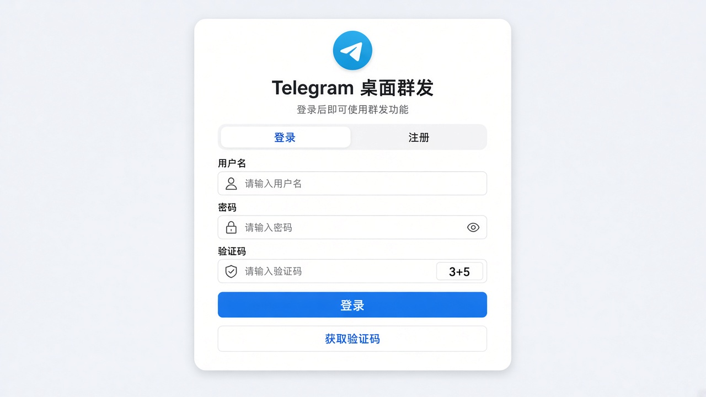
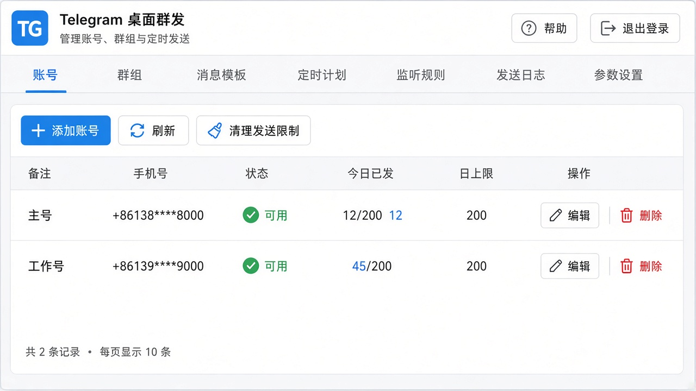
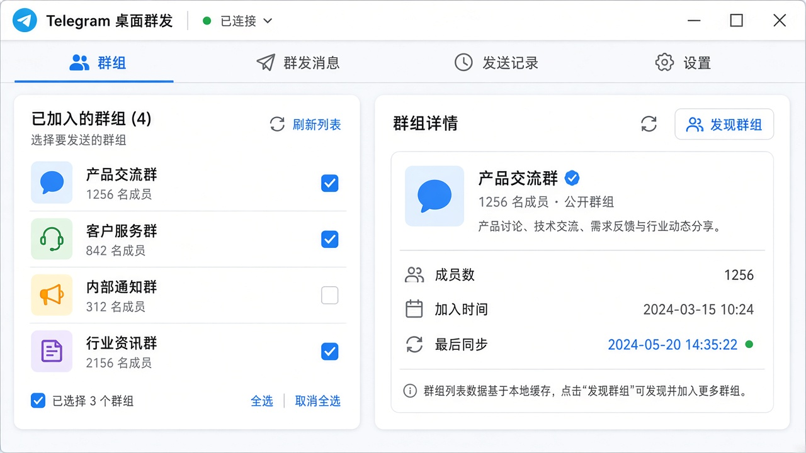
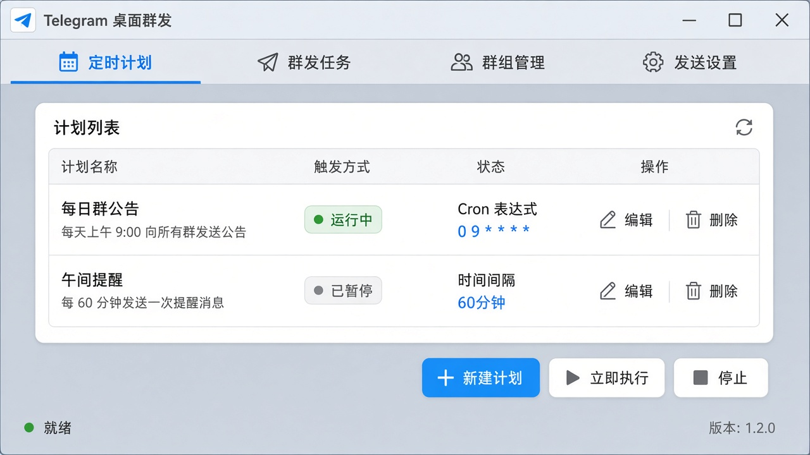
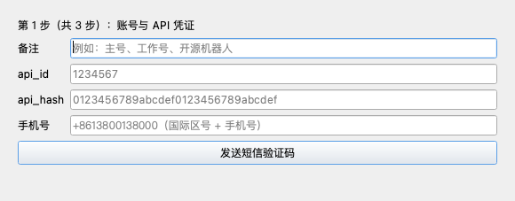

# Telegram 桌面群发工具

多账号 Telegram 定时群发桌面客户端。面向你**已经加入**的群组，支持消息模板、定时计划与发送日志，适合个人社群日常公告与提醒。

> 当前最新版本：**v0.2.22**（Windows）  
> 本仓库仅提供安装包与使用说明，便于下载，不包含源代码。

---

## 下载

| 版本 | 文件 | 说明 |
|---|---|---|
| **v0.2.22**（最新） | [tg-broadcast-v0.2.22.exe](https://github.com/myhgjb666/telegram-group-tool/releases/download/v0.2.22/tg-broadcast-v0.2.22.exe) | Windows 64 位单文件，解压即用（直接运行） |
| v0.2.21 | [tg-broadcast-v0.2.21.exe](https://github.com/myhgjb666/telegram-group-tool/releases/download/v0.2.21/tg-broadcast-v0.2.21.exe) | 上一版本 |

历史版本请到 [Releases](https://github.com/myhgjb666/telegram-group-tool/releases) 页面选择对应版本下载。

**系统要求：** Windows 10 / 11（64 位）

首次运行若被杀毒软件拦截，请选择「仍要运行」或添加信任（本工具为 PyInstaller 打包的桌面程序，容易误报）。

---

## 功能亮点

- **多账号管理**：添加多个 Telegram 账号，查看状态与今日已发 / 日上限
- **群组选择**：同步已加入群组，按任务勾选发送目标
- **消息模板**：支持多文案轮换与变量（日期、时间、群名等）
- **定时计划**：Cron 或固定间隔，可立即执行 / 暂停
- **防封控制**：发送间隔、日配额、白天窗口、抖动等可调
- **发送日志**：成功 / 失败原因可查，便于排查
- **关键词监听**：群消息或私聊命中关键字后自动私聊回复模板，带冷却与日上限
- **公开群搜索**：按关键词搜索公开群 / 频道，可限速加入并设为发送目标
- **限制中心**：显示 Telegram 限流倒计时，可查询官方 @SpamBot 的限制状态

---

## 界面预览

### 登录

### 账号管理

### 群组

### 定时计划

### 添加 Telegram 账号

---

## 快速上手

1. 下载并运行 `tg-broadcast-v0.2.22.exe`
2. 注册 / 登录软件账号（新设备通常有试用时长，到期后需续期）
3. 打开 [my.telegram.org/apps](https://my.telegram.org/apps) 登录，创建应用并拿到 `api_id` / `api_hash`
4. 在软件 **账号** 页添加 Telegram 账号（填写 api 凭证 + 手机号，完成验证码 / 二级密码）
5. 在 **群组** 页发现并勾选目标群
6. 在 **消息模板**、**定时计划** 中创建内容与计划，开始发送

---

## 版本说明

### v0.2.22（当前）

- 修复「刚启动很快、跑半小时左右越来越慢」：这是 Telegram 对重复内容群发的**限流被静默掩盖**导致——底层库默认会把 60 秒以内的限流等待「悄悄睡过去」再重试，不报错、不写日志，于是发送间隔被悄悄拉长而看不出原因。现在这类限流会如实记录到日志（含需要等待的秒数），并把该账号临时停用倒计时
- 新增发送超时保护：网络 / 代理卡顿时单条发送最多等待 120 秒，超时记为一条失败并继续后续群组，不再出现长时间「卡住不动、日志空白」
- **发送日志新增「耗时」列**：每条发送实际花了多久一目了然，便于判断是网络慢还是被限流
- 如果你的账号频繁出现限流记录，建议放慢节奏、并让文案更多样化（多用变量与多套文案），而不是只调短时间窗

### v0.2.21

- 修复「改了发送节奏、重启后又变慢」：参数设置页的群冷却、抖动、活跃时段、重复内容开关，之前只在本次运行内生效，重启或更新版本后会静默回到默认的偏保守值（群冷却 60 秒、抖动 10–60 秒），现在会随设置一起保存并在启动时自动恢复
- 新增「重复内容时间窗」设置项（默认 300 秒）：同一份文案在该时间窗内只发给一个群，防止刷屏被判违规；用静态文案群发时可把它调小来提升发送频率（数值越小越快、被风控风险越高）
- 状态栏改为显示当前实际生效的冷却与活跃时段，不再固定显示默认值

### v0.2.20

- 修复更新版本后设置丢失的问题：数据（设置、账号、群组、模板等）改为固定保存在系统数据目录（`%LOCALAPPDATA%\tg-broadcast`），不再跟随 exe 位置，换目录运行、更新版本都不会丢
- 老用户首次启动会自动把旧位置的数据迁移过来（原位置保留作备份），无需任何操作

### v0.2.19

- 彻底解决长期使用后群发变慢的问题：数据库自动维护，定期清理过期日志、防止日志表无限膨胀、按需回收磁盘空间
- 日志正文改为按需精简存储（成功不存正文、异常保留摘要），数据库体积大幅下降
- 日志页新增「压缩数据库」按钮，老库可一键立即瘦身

### v0.2.18

### v0.2.17

- 群组与账号相关流程的稳定性优化
- 若干界面细节与提示文案优化

### v0.2.16

- 群组发现的稳定性与提示文案优化
- 参数设置页精简，去掉一处冗余配置

### v0.2.15

- **私聊自动应答**：监听规则可指定「仅群消息 / 仅私聊消息 / 群+私聊」，并修复了群规则会误回复私聊的问题
- **公开群采集**：按关键词搜索 Telegram 公开群 / 频道，可少量、限速加入并直接设为发送目标（不采集群成员）
- **限制中心**：账号页新增「限制」列显示 Telegram 限流倒计时，支持查询官方 @SpamBot 限制状态与手动解除本地限流

### v0.2.14

- 修复多账号并行发送时数据库连接池耗尽（「停止计划」等操作报连接池超限）
- 「停止计划」立即生效：立刻注销定时任务、取消进行中的发送并落库停用

### v0.2.13

- 账号页新增「清理发送限制」
- 「今日已发」按防封号计数规则显示，更贴近真实可发额度

### v0.2.12

- 账号列表展示当日已发条数与上限合计

### v0.2.11

- 修复 exe 启动时的 `ImportError`（补回 `now_beijing`）

### v0.2.10

- 修复因账号「不可用」导致无法群发：日上限按北京时间落库
- 发送失败不再自动停用账号

### v0.2.9

- 修复跳过记录写不进日志
- 计划结果中展示跳过 / 失败原因

### v0.2.8

- 多账号并行发送
- 冷却与指纹按账号隔离

### v0.2.7

- 发送日志支持翻页、检索、清除与占用显示

### 更早版本摘要

- v0.2.6：慢速模式不再阻塞全局发送队列  
- v0.2.5：关闭软件后定时计划不再自动恢复；冷却可设 1 秒  
- v0.2.4：修复参数设置重复保存冲突  
- v0.2.3：发现群组增加等待动画与成功 / 失败提示  
- v0.2.2：发现群组时同步 Telegram 官方会话分组  

完整历史包请见 [Releases](https://github.com/myhgjb666/telegram-group-tool/releases)。

---

## 使用须知

- 仅向你已加入、正常参与的群组发送；请遵守 [Telegram 服务条款](https://telegram.org/tos) 与当地法律法规
- 不建议高频刷屏或向陌生人冷触达
- 账号 Session 加密保存在本机，请勿把程序目录随意拷给他人

---

## 常见问题

**Q: 打不开 / 闪退？**  
A: 确认是 64 位 Windows；可尝试以管理员运行，或把 exe 放到无英文路径目录。

**Q: 收不到 Telegram 验证码？**  
A: 验证码一般发到 Telegram App（不一定是短信）；检查手机号是否国际格式（如 `+86...`）。

**Q: 发送很慢或经常被跳过？**  
A: 先看 **发送日志** 的「状态」列（筛选切到「全部」，别只看已发送），再看「耗时」列：  
① 大量「重复内容跳过」＝同一份静态文案在「重复内容时间窗」内只能发一个群，到 **参数设置** 把它调小即可提速；  
② 文案里带 `{{group_name}}`、`{{random}}` 这类变量时，每个群内容都不同，不会被判重复。  
③ 日志出现「flood_wait Ns」或账号页显示限流倒计时＝被 Telegram 限流，等待倒计时结束即可，同时建议放慢节奏、增加文案变化，避免账号被进一步限制。  
④ 「耗时」列出现几十秒甚至 120 秒以上＝网络 / 代理慢，换更稳定的线路比调参数更有效。  
⑤ 其他跳过原因（群冷却、日上限、非活跃时段）都在日志与账号页可见。默认值偏保守，可按需微调，但不建议拉满。

---

如有问题，请在本仓库 [Issues](https://github.com/myhgjb666/telegram-group-tool/issues) 反馈，并注明版本号（如 v0.2.22）。
